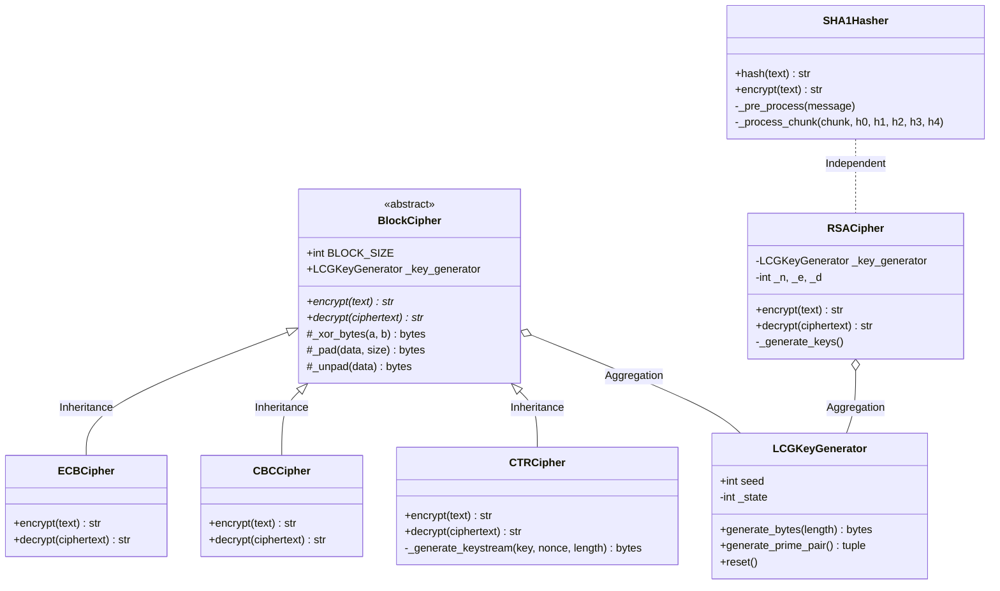

# 📚 Project Documentation — Advanced Programming Project
### Cryptographic System | Python OOP

This document contains the theoretical explanations, analysis, and diagrams required for the Advanced Programming Project, covering Tasks 1, 3, and 4.

---

## 🏗️ Task 1: Object-Oriented Programming Concepts

### 1.1 Inheritance and its Features
**Inheritance** is a fundamental OOP concept where a new class (derived or child class) inherits attributes and methods from an existing class (base or parent class).

**Key Features:**
*   **Code Reusability:** Subclasses can reuse code from the base class, reducing redundancy.
*   **Extensibility:** New functionality can be added to subclasses without modifying the base class.
*   **Transitivity:** If Class B inherits from Class A, and Class C inherits from Class B, then Class C also inherits features from Class A.

### 1.2 Types of Inheritance
1.  **Single Inheritance:** A subclass inherits from only one base class.
    *   *Example:* `ECBCipher` inherits from `BlockCipher`.
2.  **Multiple Inheritance:** A subclass inherits from more than one base class.
    *   *Example:* `class SecureCipher(Encryption, Logging): ...`
3.  **Multilevel Inheritance:** A subclass inherits from another subclass, forming a chain.
    *   *Example:* `Base -> Intermediate -> Final`.
4.  **Hierarchical Inheritance:** Multiple subclasses inherit from a single base class.
    *   *Example:* `ECBCipher`, `CBCCipher`, and `CTRCipher` all inherit from `BlockCipher`.

### 1.3 Polymorphism in Detail
**Polymorphism** allows objects of different classes to be treated as objects of a common superclass, primarily through a uniform interface.

*   **Method Overriding (Runtime Polymorphism):** A subclass provides a specific implementation of a method that is already defined in its base class. In this project, `encrypt()` and `decrypt()` are overridden in each cipher mode.
*   **Method Overloading (Conceptual):** Defining multiple methods with the same name but different parameters. While Python does not support traditional overloading (like Java/C++), it is achieved using default arguments or variable-length arguments (`*args`, `**kwargs`).

---

## 🛡️ Task 3: Exception Handling and UML

### 3.1 Exception Handling
**Exception Handling** is a mechanism to handle runtime errors, ensuring the program doesn't crash unexpectedly.

*   **try:** Contains the code that might raise an exception.
*   **except:** Contains the code that executes if an exception occurs.
*   **finally:** Contains code that *always* executes, regardless of whether an exception was raised (used for cleanup).

**Importance in Secure Systems:**
Proper exception handling prevents "Information Leakage." If a system crashes and shows a raw stack trace, an attacker might gain insights into the system's architecture or sensitive data. Secure systems catch exceptions and return generic, safe error messages.

### 3.2 Unified Modeling Language (UML)
**UML** is a standardized general-purpose modeling language used to visualize the design of a system. It provides a way to represent the architecture, components, and relationships within a software project.

### 3.3 Types of UML Diagrams
1.  **Structural Diagrams:** Focus on the static structure of the system (e.g., Class Diagram, Object Diagram, Component Diagram).
2.  **Behavioral Diagrams:** Focus on the dynamic behavior and interactions (e.g., Use Case Diagram, Sequence Diagram, State Machine Diagram).

### 3.4 Class Diagram Components
*   **Classes:** Represented by boxes with three sections (Name, Attributes, Methods).
*   **Attributes:** The data or properties of the class.
*   **Methods:** The functions or behaviors of the class.
*   **Relationships:** Connections between classes, such as Inheritance (solid line with hollow arrow) and Association.

---

## 🔍 Task 4: Analysis and Design

### 4.2 Real-World Problem Analysis: Login System
A **Login System** can be modeled using OOP to ensure security and maintainability.

*   **Classes:**
    *   `User`: Stores username and hashed password.
    *   `Authenticator`: Handles the logic for verifying credentials.
    *   `SessionManager`: Manages active user sessions.
    *   `PasswordHasher` (Base Class): Abstract interface for hashing.
    *   `SHA1Hasher` (Derived Class): Specific implementation of hashing.
*   **OOP Application:**
    *   **Inheritance:** Different types of users (e.g., `AdminUser`, `StandardUser`) inherit from a base `User` class.
    *   **Encapsulation:** The password is kept private and only accessible via secure methods.
    *   **Abstraction:** The `Authenticator` doesn't need to know *how* the hashing works, only that it gets a hash back.

### 4.3 System Class Diagram
The following diagram represents the architecture of this Cryptographic System:

---
*Generated for Advanced Programming Project — 2026*
