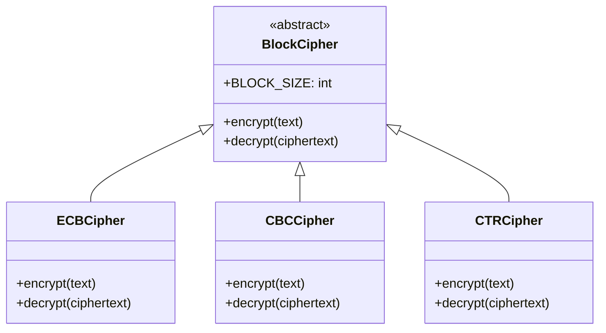
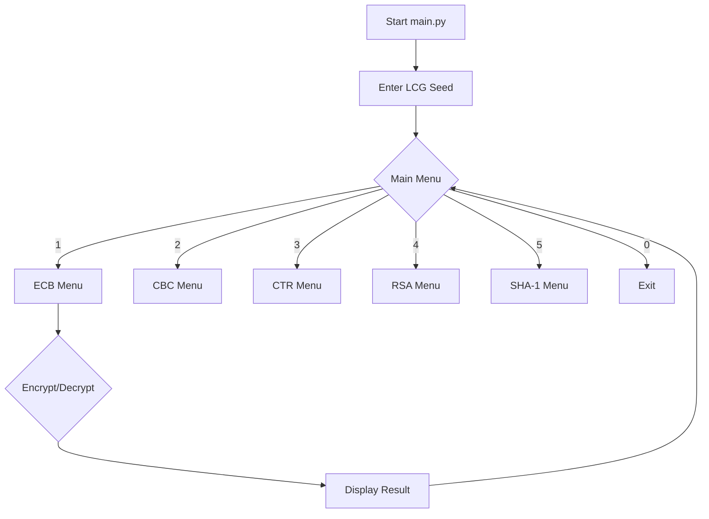
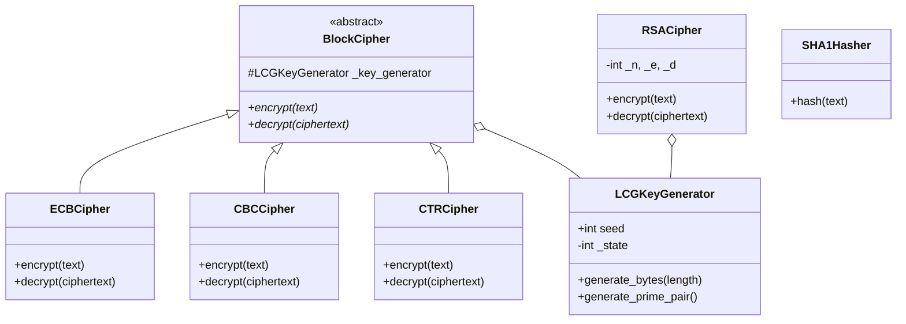

# 🔐 Comprehensive Project Analysis & Documentation Report
## Advanced Programming Project — Cryptographic System (Python OOP)

---

## 📝 Introduction
This report provides a complete analysis of the **Cryptographic System** project. It addresses all theoretical and practical requirements specified in the project scenario, mapping each point to its exact location within the codebase.

---

## 🏗️ Task 1: Object-Oriented Programming (OOP) Concepts

### 1.1 Inheritance Concept and Features
**Definition**: Inheritance is a mechanism where a new class (derived/child class) is based on an existing class (base/parent class), inheriting its attributes and methods.

**Key Features**:
- **Reusability**: Code in the base class can be reused by multiple derived classes.
- **Extensibility**: Derived classes can add new features without modifying the base class.
- **Hierarchy**: Organizes classes into a logical tree structure.
- **Transitivity**: If class B inherits from A, and C inherits from B, then C inherits from A.

📍 **Place in Project**:
- `crypto_modules/base_cipher.py`: Defines the `BlockCipher` base class (Lines 12–83).
- `crypto_modules/block_ciphers.py`: `ECBCipher`, `CBCCipher`, and `CTRCipher` inherit from `BlockCipher`.

---

### 1.2 Types of Inheritance
| Type | Description | Project Implementation |
| :--- | :--- | :--- |
| **Single** | One child inherits from one parent. | `RSACipher` depends on `LCGKeyGenerator`. |
| **Multiple** | One child inherits from multiple parents. | *Not explicitly used, but supported by Python.* |
| **Multilevel** | A chain of inheritance (A -> B -> C). | `BlockCipher` (Base) -> `CBCCipher` (Derived). |
| **Hierarchical** | Multiple children inherit from one parent. | `BlockCipher` is the parent of `ECB`, `CBC`, and `CTR`. |

**Visual: Inheritance Hierarchy**

---

### 1.3 Polymorphism in Detail
**Definition**: Polymorphism ("many forms") allows objects of different classes to be treated as objects of a common superclass, specifically through a uniform interface.

#### 1.3.1 Method Overriding (Runtime Polymorphism)
Derived classes provide a specific implementation for a method already defined in the base class.
📍 **Place in Project**: In `crypto_modules/block_ciphers.py`, each cipher class overrides the `encrypt()` and `decrypt()` methods defined in `BlockCipher`.

#### 1.3.2 Method Overloading (Conceptual)
Python does not support traditional method overloading (same name, different parameters). Instead, it uses **default arguments** or **variable arguments** (`*args`, `**kwargs`).
📍 **Place in Project**: `LCGKeyGenerator.__init__` (Line 31) uses a default argument for `seed`.

---

## 🔐 Task 2: Cryptographic System Implementation

### Part A: Block Cipher Modes
The system implements a robust hierarchy for block ciphers using the **Abstract Base Class (ABC)** pattern.

- **Base Class**: `BlockCipher` in `crypto_modules/base_cipher.py`.
- **Derived Classes**:
    - **ECB (Electronic Code Book)**: Encrypts each block independently. (In `block_ciphers.py`, Lines 24–116).
    - **CBC (Cipher Block Chaining)**: Each block is XORed with the previous ciphertext block. (In `block_ciphers.py`, Lines 122–229).
    - **CTR (Counter Mode)**: Converts block cipher into a stream cipher using a counter. (In `block_ciphers.py`, Lines 235–379).

---

### Part B: Key Generator (LCG)
**Implementation**: A dedicated `LCGKeyGenerator` class in `crypto_modules/lcg_key_generator.py`.
**Role**: Provides deterministic pseudo-random bytes and prime numbers.

📍 **Place in Project**:
- Used by **Block Ciphers** in `block_ciphers.py` (e.g., Line 59).
- Used by **RSA** in `rsa_cipher.py` (Line 75).

---

### Part C: RSA Algorithm
A simplified version of RSA is implemented in `crypto_modules/rsa_cipher.py`.
1. **Key Generation**: Uses LCG to pick small primes (Lines 72–90).
2. **Encryption**: `C = M^e mod n` (Lines 96–133).
3. **Decryption**: `M = C^d mod n` (Lines 135–168).

---

### Part D: SHA-1 Algorithm
Implemented in `crypto_modules/sha1_cipher.py`.
- **Properties**: One-way, fixed 160-bit output.
- **Implementation**: Full padding and chunk processing logic (Lines 43–153).

---

### Part E: Simple User Interface (Console Menu)
A bilingual (English/Arabic) console menu is implemented in `main.py`.

📍 **Place in Project**: `main.py` (Lines 42–51).
**Interaction Flow**:

---

## 🛡️ Task 3: Theory — Exceptions and UML

### 3.1 Exception Handling Theory
- **Try**: Block of code to be tested for errors.
- **Except**: Block of code to handle specific errors.
- **Finally**: Block of code that executes regardless of the result.
- **Importance**: In secure systems, exception handling prevents the application from crashing and avoids leaking sensitive system information via stack traces.

---

### 3.2 & 3.3 UML and Diagram Types
**UML (Unified Modeling Language)** is a standardized modeling language for software design.
- **Structural Diagrams**: Focus on the static structure (e.g., Class Diagram).
- **Behavioral Diagrams**: Focus on dynamic behavior (e.g., Sequence Diagram, Flowchart).

---

### 3.4 Class Diagram Components
- **Classes**: Blueprints for objects.
- **Attributes**: Data/Properties of the class.
- **Methods**: Functions/Actions of the class.
- **Relationships**: Inheritance (is-a), Association (has-a), Composition.

---

## 💻 Task 4: Application and Design

### 4.1 Exception Handling Implementation
The project implements extensive error checking to ensure stability and security.
📍 **Place in Project**:
- **Invalid Input**: `main.py` (Lines 151–154) catches `ValueError`.
- **Encryption Errors**: `block_ciphers.py` (Lines 72, 114) catches and raises `RuntimeError`.
- **Key Issues**: `rsa_cipher.py` (Line 89) handles key generation failures.

---

### 4.2 Real-World Problem Analysis: Login System
**Problem**: Securely authenticating users.
**OOP Design**:
- **User Class**: Stores `username` and `password_hash`.
- **AuthSystem Class**: Handles registration and login logic.
- **Encryption Link**: Uses `SHA1Hasher` (from this project) to hash passwords before storage, ensuring that even if the database is leaked, raw passwords remain hidden.

---

### 4.3 Project Class Diagram
Below is the unified class diagram representing the entire system architecture.

---

## 🚀 Bonus (Optional)

### Performance Comparison
- **Symmetric (CTR/CBC)**: High performance, suitable for large files.
- **Asymmetric (RSA)**: Computationally expensive, limited to small data (usually used for key exchange).
- **Hashing (SHA-1)**: Very fast, fixed-time complexity regardless of input growth.

### Advanced Improvements
1. **Security**: Replace SHA-1 with SHA-256 for collision resistance.
2. **UI**: The Flask web app (Member 6) provides a premium visual experience compared to the console menu.
3. **Algorithms**: Implementation of **AES** instead of XOR-based block ciphers for industrial-grade security.

---

**Report Generated by Antigravity AI**  
*Date: 2026-05-06*
